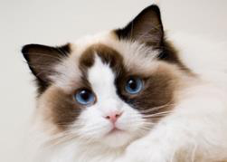
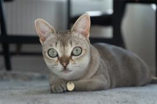
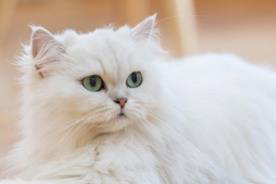
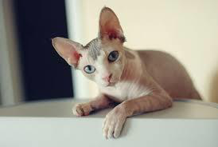
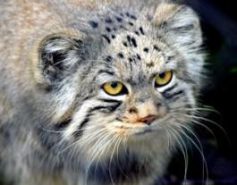

# SWS3009A Deep Learning

<!-- Source PDF page 1 -->

**IMPORTANT: THE REPORT IS DUE ON 17 JULY 2026 BUT YOU MUST FINISH EVERYTHING ELSE IN THIS ASSIGNMENT BEFORE YOUR BASELINE EVALUATION!**

## 1. Introduction

In the baseline project you will work with your Robotics partners to build a remotely piloted vehicle to look for and identify various species of cats. The idea is that there will be pictures of cats stuck at various places along a maze, and you need to pilot the vehicle to look for all the pictures and correctly identify the breed of the cats.

In this assignment your task is to collect sample images of cats, and train a model to recognize the cats.

## 2. Collecting the Images

Search the Internet and collect as many images as you can of these five species of cats

i. Ragdolls

ii. Singapura cats

iii. Persian cats

iv. Sphynx cats

v. Pallas cats

Divide your images into 85% training images and 15% validation images. You should try to keep the number of pictures of each type of cat as equal as possible. In total, you should probably aim for over 1,000 images.

Note: You can search and download the images manually. Alternatively, you can try using a scraper to automate the process. It’s quite a bit harder, but it might also be useful for your advanced model/project. You can try using Selenium: <https://medium.com/@nithishreddy0627/a-beginners-guide-to-image-scraping-with-python-and-selenium-38ec419be5ff>

## 3. Selecting and Training your Deep Learning Networks

You may choose to train a YOLO or CNN network to recognize the cats. Realistically you will not be able to train a network from scratch, so you will need to fine-tune an existing pre-trained network (i.e., perform transfer learning).

In either case you should justify your choice of deep learning network and include a 1-page writeup on the architecture:

a. If you chose to use a CNN, explain the architecture you have chosen and how you are doing the transfer learning and why.

<!-- Source PDF page 2 -->

b. If you choose to use YOLO, explain why, how you are performing classification, and transfer learning.

## 4. Submission

Fill in your answers in the answer book (SWS3009A_AssgAnsBk.docx), PDF it, and submit it to Canvas by 11.59 pm on **17 July 2026**. Ensure that the names of all team-members are included.

**NOTE: You will have your baseline evaluation on the 17th of July 2026. We have set the deadline for your report to be after your baseline evaluation to give you some breathing space, but you MUST finish everything before your team is evaluated or you will fail the evaluation.**

## Example of Each Cat Type

| Ragdoll | Singapura | Persian |
| --- | --- | --- |
|  |  |  |

| Sphynx | Pallas |
| --- | --- |
|  |  |
