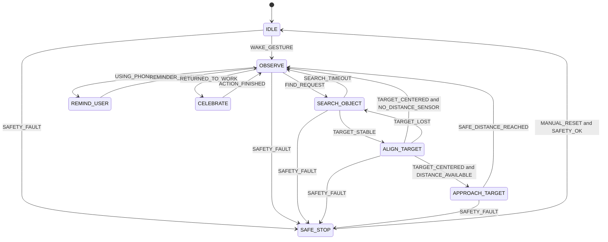

# DeskMate Advanced：本地 4070 多专家完整计划

> 版本：v0.4（Post-Baseline Multi-Expert Perception）
> 日期：2026-07-14
> 计算资源：单台 NVIDIA RTX 4070，不租用云端 GPU
> 目标：在有限时间内完成一个稳定、可解释、可重复演示的“感知—语义—决策—动作”闭环

---

## 0. 与正式 Baseline 的关系

本文件只描述 **7 月 17 日正式 Baseline 通过之后**启动的 Advanced 项目。
正式 Baseline 的唯一执行计划是 [`BASELINE_PLAN.md`](BASELINE_PLAN.md)。在
Baseline Gate B4（连续三次完整联排）通过并冻结 release 之前，不为本文件的
多专家模型、行为语义或自主动作投入关键路径时间。

Advanced 不从零重建工程底座，而是复用 Baseline 已经在机器人真实视频流中验证过的
模块：

| Baseline 资产 | Advanced 复用方式 |
| --- | --- |
| `FramePacket`、摄像头/网络流读取与重连 | 直接作为所有专家的统一输入与时钟来源 |
| Ultralytics/PyTorch/CUDA 环境及 train/val/predict/export 工具链 | 从 `yolo26s-cls.pt` classify 延续到 `yolo26n.pt` detection |
| 模型 manifest、离线权重缓存、设备选择 | 扩展为 M01–M05 多模型注册表，但登记新的 detection 权重和 schema |
| `ModelRunner[OutputT]` 生命周期和健康检查 | 复用 generic runner 与 fixture 模式；将 Baseline `ClassificationObservation` 替换为 detection `ExpertObservation` |
| 视频录制、回放和延迟统计 | 作为专家消融、融合规则和端到端回归测试工具 |
| OpenCV UI、控制台事件与截图证据 | 扩展显示检测框、WorldState、FSM 和机器人命令 |
| 机器人视频连接配置与集成清单 | 原样用于 Advanced 联调，避免重复解决网络问题 |

明确 **不复用** 的是五种猫分类 head、猫权重、类别映射、猫数据集、分类阈值和
`Results.probs` 输出 schema；它们属于任务特定资产，不能直接变成 object detection
模型或 bounding-box 数据。Advanced 的第一项代码工作应是把 Baseline 的通用模块抽取
为稳定包，并用原 Baseline 回放测试证明重构没有破坏已有能力。

---

## 1. 最终决策

项目定位为 **桌面伴侣机器人 DeskMate**。Advanced P0 只实现一条完整主线：

1. 摄像头观察用户和桌面物体；
2. 全局物体、面部/眼部、手部三个小型专家模型按需处理同一视频流；
3. 将带时间戳、Track ID 和有效期的专家输出融合成语义事件；
4. 有限状态机根据事件选择行为；
5. 小车执行转向、搜索、靠近、提醒和庆祝动作；
6. 界面同步显示检测框、世界状态、决策和控制命令。

Advanced P0 的成功标准不是“功能最多”，而是 **同一套代码能够连续稳定完成完整 Demo，且任何感知或通信故障都会安全停车**。多专家模型只改造感知层，不改变 `WorldState → Semantic Event → FSM → Safety Gate` 的主链路。

### 1.1 计划假设

- 有约 10 个有效开发日；如果工期更长，后续时间全部用于数据扩充和可靠性优化。
- 团队约 3–5 人；文档中的分工按 4 人设计，可合并岗位。
- Deep Learning 代码运行在带 RTX 4070 的电脑上，不要求部署到树莓派或微控制器。
- 机器人端至少能接收前进、后退、左转、右转、停止命令。
- 机器人最好提供前方距离或碰撞状态；如果没有，Advanced P0 取消自动前进，只保留原地搜索和指示目标。
- 摄像头可以是机器人摄像头、USB 摄像头或网络视频流。
- 演示时不依赖互联网，模型权重和依赖必须提前下载。
- 不进行人脸识别，不保存身份信息，视觉数据只用于本地开发和演示。

---

## 2. 90 秒 Demo 剧本

Demo 使用固定桌面、固定物体集合和单个用户，建议按下列顺序执行。

### 场景 A：唤醒与观察（0–15 秒）

1. 小车处于 `IDLE`。
2. 用户张开手掌或挥手。
3. 系统稳定识别手势后，小车转向用户，进入 `OBSERVE`。
4. 屏幕显示 `gesture=open_palm` 和当前状态。

### 场景 B：寻找物体（15–55 秒）

1. 用户在界面选择 `Find bottle`，或按预设快捷键发出同等指令。
2. 系统进入 `SEARCH_OBJECT`，小车分段旋转扫描桌面。
3. 检测到瓶子后锁定目标，进入 `ALIGN_TARGET`。
4. 根据检测框横向位置控制小车左转或右转，使目标进入画面中央。
5. 如果有可靠的距离传感器，小车低速接近，在安全距离停止；否则原地朝向目标并通过灯光、蜂鸣器或界面指出位置。
6. 屏幕显示目标类别、置信度、Track ID 和搜索耗时。

### 场景 C：行为观察与提醒（55–90 秒）

1. 用户回到工作姿态，系统显示 `behavior=working`。
2. 用户拿起手机并保持至少 3 秒。
3. 界面同时显示物体专家的手机框、手部专家的腕部/手势以及面部专家的头部/眼部信号。
4. 融合层结合“手机可见＋手机靠近手部＋头部/视线辅助证据＋持续时间”生成 `USING_PHONE_STABLE` 事件；面部不可用时按可用证据重新归一化，不阻塞判断。
5. FSM 进入 `REMIND_USER`，机器人做一次可见提醒动作。
6. 用户放下手机并恢复工作至少 3 秒。
7. 系统进入 `CELEBRATE`，机器人做短暂庆祝动作，然后返回 `OBSERVE`。

### Demo 叙事重点

- 检测框不是最终成果；真正亮点是“时间语义触发行为”。
- 主持人应解释为什么系统等到行为持续数秒后才提醒，以展示去抖和误触发控制。
- UI 必须同时展示模型输出和 FSM 状态，使评委能够看到决策依据。

---

## 3. 范围控制

### 3.1 P0：必须完成

- 摄像头、视频文件两种输入方式；
- 全局物体专家实时检测人、手机和桌面目标；
- 面部/眼部专家输出面部质量、头部朝向、眨眼和视线相关系数；
- 手部专家输出 21 个关键点、左右手和预置手势；
- 专家调度器、ROI 路由、时间戳对齐和输出 TTL；
- 目标追踪和目标丢失处理；
- 张掌/挥手唤醒；
- `working`、`using_phone`、`away` 三种语义状态；
- 查找瓶子或杯子中的至少一种目标；
- FSM 决策；
- 模拟小车适配器和真实小车适配器使用同一接口；
- 命令超时、急停和安全停车；
- 实时可视化和 JSONL 事件日志；
- 录制视频回放测试；
- 一键启动脚本和离线演示材料。

### 3.2 P1：P0 稳定后添加

- 同时查找 3–5 种目标；
- 语音转固定意图，如 `find bottle`；
- 检测物品是否位于指定桌面区域；
- 浏览器 Dashboard；
- 使用姿态和物体关系特征训练小型 GRU/TCN 行为分类器；
- 加入 MediaPipe Pose 专家识别上半身姿态；
- 使用 Model Maker 微调自定义静态手势分类头；
- 更丰富的机器人表情、灯光或声音反馈。

### 3.3 本轮明确不做

- 真正抓取或通用桌面整理；
- SLAM、地图构建和复杂路径规划；
- 多人身份识别；
- 大型 VLM、本地大语言模型或视频 Transformer；
- 端到端“图像直接输出电机动作”；
- 云端推理、云端 GPU 训练和必须联网的 API；
- 对未知任意物体进行可靠的开放词汇搜索。

---

## 4. 系统架构

```mermaid
flowchart LR
    Camera["Camera / Recorded Video"] --> Capture["Frame Capture"]
    Capture --> Packet["FramePacket + Timestamp"]
    Packet --> Object["M01 Object Expert"]
    Object --> Tracker["C01 ByteTrack"]
    Tracker --> Router["ROI / Track Router"]
    Packet --> Router
    Router --> Face["M02 Face & Eye Expert"]
    Router --> Hand["M03 Hand Expert"]
    Tracker --> Buffer["ExpertObservation Buffer"]
    Face --> Buffer
    Hand --> Buffer
    Buffer --> Fusion["Temporal Evidence Fusion"]
    Fusion --> World["WorldState"]
    World --> Semantic["Semantic Event Engine"]
    Semantic --> FSM["Decision FSM"]
    FSM --> Safety["Safety Gate"]
    Safety --> Adapter["Mock / Serial / UDP Adapter"]
    Adapter --> Robot["Robot Controller"]
    World --> UI["Overlay and Event Log"]
    FSM --> UI
```



### 4.1 实现原则

- 使用一个模块化 Python 进程，不在 Advanced P0 阶段拆微服务，也不引入 ROS。
- 摄像头采集与模型推理解耦，只保留最新帧，避免延迟不断积累。
- 不设置“等待同一帧所有专家完成”的同步屏障；融合层读取最近且尚未过期的观察值。
- 全局模型处理整帧，面部和手部专家只在存在有效人员 ROI 时运行。
- 专家只输出视觉事实；语义引擎负责时间窗口和证据融合；FSM 只负责行为选择。
- 机器人适配器不能知道模型细节，只接收经过安全层过滤的高层命令。
- 所有中间状态都可记录和回放，硬件未完成时也能测试决策链路。

### 4.2 推荐技术栈

| 功能 | Advanced P0 选择 |
|---|---|
| 语言 | Python 3.11 |
| 全局物体专家 | PyTorch + Ultralytics；`yolo26n.pt` baseline / evidence-gated `yolo26s.pt`，RTX 4070 |
| 面部/眼部专家 | Google MediaPipe `face_landmarker.task`，Windows CPU |
| 手部专家 | Google MediaPipe `gesture_recognizer.task`，Windows CPU |
| 可选姿态专家 | `qualcomm/MediaPipe-Pose-Estimation`，仅 P1 |
| 视频处理 | OpenCV |
| 目标追踪 | ByteTrack |
| 专家融合 | P0 为带缺失值处理的规则融合；P1 为自训练小型 GRU/TCN |
| 配置 | YAML |
| 日志 | Python logging + JSONL 事件日志 |
| 测试 | pytest + 录制视频回放 |
| 底盘通信 | 优先串口；网络底盘使用 UDP/TCP 适配器 |
| Advanced UI | OpenCV 单窗口叠加层；Web UI 仅作为 P1 |

依赖必须在环境验证后锁定精确版本，禁止展示前自动升级。

---

## 5. 多专家感知模型计划

### 5.1 模型总表

P0 固定为 **三个预训练专家模型＋一个非神经网络追踪组件**。除非基准测试证明某个专家无法提供有效信息，不再增加第四个 P0 模型。

这里的“P0 必需”表示必须完成接入、评估、日志和降级路径；不表示该模型必须成为每个行为的硬条件。尤其 `M02` 未通过真实机位质量门槛时仍保留可视化，但从动作触发证据中移除。

| ID | 优先级 | 模型/组件 | 准确来源 | 运行位置 | 主要职责 | 微调 | 许可证/审核 |
|---|---|---|---|---|---|---|---|
| `M01` | P0 必需 | Ultralytics YOLO26n baseline；YOLO26s evidence-gated challenger | [Hugging Face: `Ultralytics/YOLO26`](https://huggingface.co/Ultralytics/YOLO26)，候选权重 `yolo26n.pt` / `yolo26s.pt` | RTX 4070 / PyTorch | 人、手机、瓶子、杯子、书本、笔记本电脑检测 | 先测预训练；真实机位 recall/漏检不过门才微调 | HF 标注 AGPL-3.0 |
| `M02` | P0 必需 | MediaPipe Face Landmarker | [Google 官方 `face_landmarker.task`](https://storage.googleapis.com/mediapipe-models/face_landmarker/face_landmarker/float16/latest/face_landmarker.task) | CPU / MediaPipe | 478 个面部关键点、52 个 blendshape、头部变换矩阵 | 否，只校准阈值 | Gate 1 前归档官方模型卡与资产条款 |
| `M03` | P0 必需 | MediaPipe Gesture Recognizer | [Google 官方 `gesture_recognizer.task`](https://storage.googleapis.com/mediapipe-models/gesture_recognizer/gesture_recognizer/float16/latest/gesture_recognizer.task)；[HF 参考实现](https://huggingface.co/qualcomm/MediaPipe-Hand-Gesture-Recognition) | CPU / MediaPipe | 21 个手部关键点、左右手、预置手势 | 否；自定义手势才微调分类头 | Google bundle 条款待归档；HF 参考卡标注 `other` |
| `C01` | P0 必需 | ByteTrack | 随 Ultralytics Track 模式集成，[官方说明](https://docs.ultralytics.com/modes/track/) | CPU | 为物体和人员维持 Track ID | 不适用，不是神经网络 | 随实际 Ultralytics 发行版本审核 |
| `M04` | P1 可选 | MediaPipe Pose Landmarker Lite | [Google 官方 lite bundle](https://storage.googleapis.com/mediapipe-models/pose_landmarker/pose_landmarker_lite/float16/latest/pose_landmarker_lite.task)；[HF 模型卡参考](https://huggingface.co/qualcomm/MediaPipe-Pose-Estimation) | CPU / MediaPipe，需本机实测 | 33 个姿态点及腕、肩、肘关系 | 默认不微调 | Google bundle 条款待归档；HF 参考卡标注 `other` |
| `M05` | P1 可选 | `DeskMate-FusionGRU-v1` | 团队自行训练，无预训练权重 | CPU 或 RTX 4070 | 将连续专家特征分类为工作、用手机、离开等行为 | 从专家特征训练 | 团队自行确定发布许可证 |

### 5.2 模型使用边界

#### `M01`：全局物体专家

- 输入：完整视频帧，默认 `640×640` letterbox；
- 频率：目标 8–12 Hz；
- 输出：类别、框、置信度，经 `C01` 后增加 Track ID；
- 用途：目标搜索、人员 ROI、手机与手部的空间关系、工作物体区域；
- 初始模型：先用预训练 `yolo26n.pt` 建立真实机位 per-class recall、false positive、P95
  和端到端吞吐基线；
- 模型尺寸：只有 `n` 的关键类 recall 不足，且全 P0 专家运行时仍有 P95/吞吐余量，才在
  同一验证视频上比较 `yolo26s.pt`；按场景成功率和总系统延迟选型，不能只看 COCO 指标；
- 微调：预训练候选在真实桌面视频上未过 Gate 时，才使用本项目桌面数据微调所选
  `n` 或 `s`；微调前后必须在同一 held-out 视频上比较；
- 回退：若 YOLO26 当前环境不兼容，固定使用 [Ultralytics/YOLO11](https://huggingface.co/Ultralytics/YOLO11) 的 `yolo11n.pt`，其余接口不变；
- 许可证：官方 HF 模型卡标注 AGPL-3.0，项目归档时保留模型卡、许可证和来源；如未来商业化必须重新做许可证审查。

#### `M02`：面部/眼部专家

- 输入：由人员 Track 生成的上半身 ROI；Face Landmarker 内部继续完成面部定位和跟踪；
- 频率：目标 10–15 Hz，仅在单人 ROI 清晰时运行；
- 输出：面部存在与质量、478 个关键点、52 个 blendshape、面部变换矩阵；
- P0 使用字段：`eyeBlinkLeft/Right`、`eyeLook*`、`eyeSquint*`、`eyeWide*` 和由变换矩阵估计的头部 yaw/pitch；
- 配置必须启用 `output_face_blendshapes=true` 和 `output_facial_transformation_matrixes=true`；
- 不将单帧眨眼直接解释为疲劳或分心，所有眼部事件必须经过时间窗口；
- 质量门控：脸部过小、明显侧脸、遮挡或输出过期时，面部证据标为 `unknown`，融合层按剩余证据重新归一化；
- 微调：P0 不微调 Face Landmarker，只在真实摄像头视频上校准阈值。若效果不足，先调整机位和 ROI，再考虑替换模型。

Hugging Face 上的 [`qualcomm/MediaPipe-Face-Detection`](https://huggingface.co/qualcomm/MediaPipe-Face-Detection) 可作为 ONNX/移动端参考，但它不替代 P0 所需的完整 478-landmark＋52-blendshape 官方 bundle。

#### `M03`：手部专家

- 输入：由人员 Track 生成的人员 ROI；
- 频率：目标 10–15 Hz；
- 输出：左右手、21 个关键点、世界坐标和预置手势；
- P0 手势仅使用 `Open_Palm`、`Closed_Fist`、`Pointing_Up`、`Thumb_Up`，其余类别记录但不触发行为；
- `wave` 不是单帧预置类别，而是 `Open_Palm` 加腕部横向运动的时间事件；
- `phone_near_hand` 由手机框与腕/掌关键点的归一化距离计算；
- 微调：预置手势达到验收门槛时不微调。确需自定义手势时，只用 MediaPipe Model Maker 训练轻量手势分类头，列为 P1。

#### `M04`：姿态专家（P1）

- 只有当 `M01+M02+M03` 无法区分必要行为时才启用；
- 典型新增信息是肩、肘、腕和躯干角度；
- 不用于重复生成已经由手部或面部专家提供的信号；
- 模型卡许可证字段为 `other`，启用前必须单独阅读并归档其许可证文件。

#### `M05`：融合模型（P1）

- 输入不是原始图像，而是连续 2–3 秒的标准化专家特征；
- 初始特征建议为 20–40 维，包括头部 yaw/pitch、眼部系数、手势概率、手机—手距离、物体存在、工作区关系和有效性 mask；
- 输出为 `working / using_phone / away / attention_away / unknown`；
- 在 P0 规则融合达到稳定基准后才采集特征序列并训练；
- 必须与规则融合做相同测试视频的对照，只有场景成功率更高且延迟合格才替换 P0 融合器。

### 5.3 专家调度与算力分配

同一个 `FramePacket(frame_id, timestamp_ms, image)` 可以被多个专家引用，但系统 **不等待同一帧的所有模型同时返回**。

| 模块 | 触发条件 | 建议频率 | 设备 | 输出 TTL 初值 |
|---|---|---:|---|---:|
| 摄像头采集 | 始终 | 30 FPS | CPU | 500 ms |
| `M01` selected YOLO26n/s | 始终 | 8–12 Hz | RTX 4070 | 300 ms |
| `C01` ByteTrack | 有新检测或视频帧 | 与检测/追踪实现一致 | CPU | 500 ms |
| `M02` Face Landmarker | 存在有效 person ROI 且图像质量合格 | 10–15 Hz | CPU | 500 ms |
| `M03` Gesture Recognizer | 存在有效 person ROI | 10–15 Hz | CPU | 500 ms |
| 时间融合 | 始终 | 10 Hz | CPU | 不适用 |
| FSM | 有新语义事件或 5–10 Hz tick | 5–10 Hz | CPU | 不适用 |

调度规则：

1. Capture 线程只保留最新帧，禁止积压视频队列；
2. `M01` 先产生 person/目标 Track，ROI Router 再触发 `M02/M03`；
3. MediaPipe 使用 `LIVE_STREAM`/异步模式，忙时允许跳过旧帧；
4. Windows 环境下 MediaPipe P0 默认使用 CPU，避免与 PyTorch 争抢 CUDA 上下文；
5. 初版先使用可测量的顺序/异步流水线，不在没有 profiling 证据时创建多个并行 CUDA session；
6. 任一专家超过 TTL 的结果视为缺失，不得把旧状态当作当前事实；
7. 只有系统实测总吞吐低于 10 FPS 时才降低专家频率或输入尺寸。

### 5.4 标准专家输出

所有专家必须转换成同一个 envelope，不能把框架原生对象直接传给语义层：

```json
{
  "model_id": "M03",
  "model_version": "gesture_recognizer-float16-latest-pinned",
  "frame_id": 1532,
  "timestamp_ms": 1720940000000,
  "track_id": 1,
  "source_roi": [0.14, 0.08, 0.83, 0.97],
  "values": {
    "gesture": "Open_Palm",
    "gesture_score": 0.91,
    "wrist_xy": [0.54, 0.61]
  },
  "quality": 0.88,
  "valid_until_ms": 1720940000500
}
```

统一要求：

- 坐标从 ROI 映射回全图后再输出，并归一化到 `[0,1]`；
- 每条观察包含模型 ID、模型版本、原始帧时间、Track ID、质量和有效期；
- 模型没有结果时输出显式 `missing/unknown`，不能伪造零值；
- 日志记录每个专家的推理耗时、输出年龄和丢帧数；
- `models/manifest.yaml` 固定下载源、文件名、SHA-256、许可证和启用状态。

### 5.5 微调决策顺序

1. 将 `M01/M02/M03` 原始权重全部下载到本地并记录 SHA-256；
2. 用机器人真实机位录制 5–10 分钟、覆盖全部 Demo 动作的基准视频；
3. 分别评估三个专家的准确率、缺失率、延迟和新增信息价值；
4. 先比较 `yolo26n` 与真实机位 Gate；只有关键类 recall/场景成功率不过门才比较
   `yolo26s` 或微调所选模型，并在相同 held-out 视频上记录前后结果；
5. `M03` 只有预置手势无法满足剧情时才训练自定义分类头；
6. `M02` P0 不微调，只做阈值、ROI 和机位校准；
7. 不为“显得模型多”保留无独立贡献的专家；
8. P0 三专家闭环通过 Gate 2 后，才决定是否启用 `M04/M05`。

### 5.6 YOLO 检测类别

第一轮固定为以下 6 类：

| ID | 类别 | 用途 | 说明 |
|---:|---|---|---|
| 0 | `person` | 人员存在、行为判断 | 可先使用预训练类别，再补目标视角数据 |
| 1 | `phone` | 使用手机行为 | 关键类别，需覆盖手持、桌面和部分遮挡 |
| 2 | `bottle` | 目标搜索 | Demo 主目标，外形应明显 |
| 3 | `cup` | 第二搜索目标 | 与 bottle 区分 |
| 4 | `book` | 工作语境 | 包括书和笔记本，但标注规则必须统一 |
| 5 | `laptop` | 工作语境 | 直接支持 `working` 语义；覆盖打开、合上、屏幕明暗和部分遮挡 |

如果预训练模型已经能稳定识别某类，仍需在 Demo 摄像头视角上验证；不要仅凭公开视频结果决定是否微调。

### 5.7 数据规模和采集方法

目标为 **800 张左右有效图片**，最低可用规模为 500 张。

- 从机器人实际摄像头采集为主，普通手机照片只用于补充。
- 录制多段视频后每隔若干帧抽取，避免完全重复的连续帧。
- 包含至少 3 种照明、4 种摄像头方向、多个物体摆放位置。
- 关键类别 `phone` 和 `bottle` 各至少出现 250 次，`laptop` 至少出现 150 次。
- 至少 15% 图片不包含搜索目标，用于抑制误检。
- 至少 20% 样本包含遮挡、运动模糊或画面边缘目标。
- 单人 Demo 不需要收集大量不同人物，但应包含 3 名组员用于验证泛化。

另建一组 **不用于微调的专家验证视频**：至少 5–10 分钟，包含张掌、握拳、挥手、拿起/放下手机、正视、低头、左右转头、正常眨眼、短时闭眼和脸/手离开画面。按时间区间标注事件，用于校准 `M02/M03` 和融合层；不要把相邻帧随机拆到训练和测试两侧。

### 5.8 标注规范

- 框住可见物体的最小外接矩形，不把阴影包含在框内。
- 物体可识别时即使部分遮挡也标注；仅剩无法判断的小片段时不标注。
- 宽或高低于约 12 像素的目标不作为有效训练样本。
- `book` 必须统一包含封闭书本和打开书本，或者在采集前明确只保留一种。
- 不创建 `working`、`using_phone` 检测类别；它们属于时间语义，而不是单帧物体。
- 每完成 100 张标注，由另一名组员抽检 20 张。

### 5.9 数据切分

- Train 70%、Validation 15%、Test 15%。
- 按 **录制片段/采集批次** 切分，不随机拆分相邻视频帧，防止数据泄漏。
- 单独保存 5 段完整 Demo 场景视频作为系统测试集，不参与模型训练。

### 5.10 YOLO 本地训练配置

初始配置：

```yaml
model: yolo26n.pt  # default candidate; replace only after same-video n/s benchmark
imgsz: 640
epochs: 60
batch: 8
device: 0
amp: true
patience: 15
workers: 4
seed: 42
```

训练步骤：

1. 先用预训练模型在 2 段真实视频上跑基准，记录漏检类型；
2. 训练第一版 60 epoch，保留验证集最佳权重；
3. 查看混淆矩阵和关键类别 PR 曲线；
4. 针对漏检场景补采数据，而不是盲目增加 epoch；
5. 在完全独立的 Demo 视频上确定每类阈值；
6. 固定最终权重并保存模型文件、配置、指标和依赖版本。

若显存不足，按 `batch 8 → 4 → imgsz 512` 的顺序降级；不需要租用 GPU。

### 5.11 多专家感知验收门槛

以下是项目门槛，不是论文级目标：

- 独立测试集总体 `mAP50 >= 0.75`；
- `phone`、`bottle` 在 Demo 测试集上的 Recall 均不低于 0.85；
- `M03` 在真实机位下的张掌唤醒成功率至少 9/10，连续 5 分钟静止工作场景误唤醒不超过 1 次；
- 手部清晰可见的标注片段中，腕部关键点有效输出比例至少 90%；
- 面部清晰、角度在 Demo 约束内的标注片段中，`M02` 有效输出比例至少 85%；
- 正视/低头和睁眼/持续闭眼事件在专家验证视频上的宏平均 F1 目标不低于 0.80；未达标时面部信号只展示和记录，不进入动作触发条件；
- 4070 上完整感知链路达到至少 10 FPS；
- 感知延迟 P95 不高于 200 ms；
- 任一专家缺失或过期时，融合和 FSM 仍能运行且不会使用旧值；
- 固定场景中目标锁定成功率至少 8/10；
- 连续 5 分钟运行不发生显存持续增长或程序崩溃。

如果 mAP 达标但 Demo 场景失败，以场景成功率为准继续补数据。

---

## 6. 语义理解计划

Advanced P0 不训练大型行为视频模型，而是将 `M01/M02/M03` 的检测、面部/眼部和手部输出组合成结构化语义。P0 使用可解释的证据融合；只有在积累足够的专家特征序列后才训练 `M05`。

### 6.1 `WorldState` 数据结构

```json
{
  "timestamp_ms": 1720940000000,
  "frame_id": 1532,
  "person": {
    "present": true,
    "box": [0.14, 0.08, 0.83, 0.97],
    "track_id": 1
  },
  "objects": [
    {
      "class": "phone",
      "confidence": 0.91,
      "box": [0.48, 0.42, 0.58, 0.62],
      "track_id": 7
    }
  ],
  "expert_status": {
    "M01": {"age_ms": 20, "quality": 0.91, "valid": true},
    "M02": {"age_ms": 40, "quality": 0.82, "valid": true},
    "M03": {"age_ms": 75, "quality": 0.88, "valid": true}
  },
  "face": {
    "visible": true,
    "head_yaw": 4.2,
    "head_pitch": 18.5,
    "eye_closed_score": 0.07,
    "gaze_down_score": 0.73,
    "quality_ok": true
  },
  "hands": [
    {
      "handedness": "Right",
      "gesture": "None",
      "gesture_score": 0.62,
      "wrist_xy": [0.53, 0.60],
      "phone_distance": 0.08
    }
  ],
  "behavior": "using_phone",
  "behavior_confidence": 0.87,
  "behavior_duration_ms": 3400,
  "target": {
    "class": "bottle",
    "visible": false,
    "center_x": null,
    "track_id": null
  },
  "safety": {
    "front_distance_cm": 42.0,
    "camera_ok": true,
    "controller_ok": true,
    "estop": false
  }
}
```

坐标统一使用 `[0, 1]` 全图归一化坐标，时间统一使用毫秒。`age_ms` 超过该模型 TTL 时，`valid` 必须变为 `false`，对应字段在融合时视为缺失而不是数值 0。

### 6.2 行为规则

#### `away`

- 连续至少 2 秒没有稳定 `person` 检测；
- 单帧漏检不改变状态。

#### `using_phone`

硬条件是 `phone_visible=true`。在此基础上，至少满足一个主证据，并在最近 20 次融合 tick 中至少 15 次成立：

- `M03`：手机框中心靠近任一腕/掌关键点；
- `M01+C01`：手机被持续追踪且从桌面区域移动到人体上半身区域；
- `M01`：手机框与人体上半身区域明显重叠。

`M02` 的低头、向下看只作为辅助证据提高置信度，面部缺失时不阻塞 `using_phone`。融合分数按当前有效证据重新归一化，但不能在缺少全部手部和空间关系证据时仅凭低头判定使用手机。

首次触发后还需持续 3 秒才生成 `USING_PHONE_STABLE`，避免拿起手机的一瞬间触发提醒。

#### `working`

- 人员存在；
- 不满足 `using_phone`；
- `M01` 检测到书本/笔记本电脑，或 `M03` 的手部位于工作区附近；
- `M02` 的正向头部/视线可提高置信度，但不是硬条件；
- 条件保持至少 2 秒。

如果书本和笔记本电脑均无法可靠检测，Advanced P0 将 `working` 定义为“人员在场且未使用手机”，并在海报中如实说明。

#### `wave/open_palm`

- `M03` 的 `Open_Palm` 置信度达到阈值；
- `open_palm` 使用最近 10 个有效手部结果至少 6 个成立；
- `wave` 还要求腕部 x 坐标在时间窗口内完成足够的横向往返；
- 触发后设置 2 秒冷却时间，防止重复唤醒。

#### 面部/眼部状态

- `blink`：左右 `eyeBlink` 系数短时上升后恢复，只用于展示和日志；
- `eyes_closed`：双眼闭合证据持续超过阈值，不能由单帧触发；
- `attention_away`：头部朝向或视线偏离持续至少 2 秒；
- 这些状态在 `M02` 未通过 5.11 验收前不触发机器人动作，只作为 `working` 置信度的辅助量。

### 6.3 时间平滑

每个离散事件必须包含：

- 进入阈值；
- 退出阈值；
- 最短持续时间；
- 冷却时间；
- 置信度不足时的 `unknown` 状态。

融合时还必须满足：

- 先按 `track_id` 关联同一个人，再按时间戳读取各专家最近有效结果；
- 不要求各模型来自完全相同的 `frame_id`，但任何观察不得超过 TTL；
- 质量门控失败和过期值按缺失处理，不能按负样本处理；
- 证据权重只在当前有效字段之间重新归一化；
- 记录每次行为判断使用了哪些模型，UI 显示类似 `using_phone <- M01+M03 (+M02 auxiliary)`；
- 禁止将低置信度结果强行归类为某个行为。

---

## 7. 行为决策 FSM

### 7.1 状态定义

| 状态 | 含义 | 允许输出 |
|---|---|---|
| `IDLE` | 等待唤醒 | `STOP`、灯光待机 |
| `OBSERVE` | 观察人员和桌面 | `STOP`、轻微表情动作 |
| `SEARCH_OBJECT` | 分段旋转搜索 | `TURN_LEFT/RIGHT`、`STOP` |
| `ALIGN_TARGET` | 将目标移到画面中央 | `TURN_LEFT/RIGHT`、`STOP` |
| `APPROACH_TARGET` | 有距离保护时低速接近 | `FORWARD`、`STOP` |
| `REMIND_USER` | 对稳定分心事件做一次提醒 | 灯光、蜂鸣、短动作 |
| `CELEBRATE` | 用户恢复工作后的反馈 | 短时灯光或旋转 |
| `SAFE_STOP` | 任何安全或通信异常 | 仅 `STOP` |

### 7.2 核心转移



### 7.3 搜索与对准参数初值

- 搜索采用 300–500 ms 的低速转动，再停顿等待画面稳定；
- 目标中心 `x < 0.43` 时左转，`x > 0.57` 时右转；
- 目标连续 3 个有效推理帧处于中央才视为对准；
- 丢失目标不立即换状态，保留约 500 ms 缓冲；
- 单次搜索设置 12 秒超时，超时后停止并回到 `OBSERVE`；
- 接近速度不超过底盘安全速度的 30%；
- 没有独立距离信息时禁止进入 `APPROACH_TARGET`。

这些数值必须写入 YAML，而不是散落在代码中。

---

## 8. 机器人接口契约

### 8.1 视觉系统发送命令

串口或网络消息统一使用一行一个 JSON：

```json
{
  "seq": 123,
  "timestamp_ms": 1720940000000,
  "command": "TURN_LEFT",
  "speed": 0.25,
  "ttl_ms": 300,
  "reason": "target_left_of_center"
}
```

命令集合固定为：

```text
STOP
FORWARD
BACKWARD
TURN_LEFT
TURN_RIGHT
LED_IDLE
LED_ALERT
BUZZ_ONCE
```

### 8.2 底盘返回状态

```json
{
  "seq_ack": 123,
  "timestamp_ms": 1720940000021,
  "front_distance_cm": 42.3,
  "bumper": false,
  "estop": false,
  "controller_ok": true
}
```

### 8.3 强制安全要求

- 每条运动命令必须携带 `ttl_ms`；到期未收到新命令，底盘自行停车。
- 视觉程序每次状态切换先发送 `STOP`，再发送新的运动命令。
- 摄像头超过 500 ms 没有新帧时进入 `SAFE_STOP`。
- 控制器超过 500 ms 没有响应时进入 `SAFE_STOP`。
- 碰撞、急停或距离过近的状态优先级高于任何 AI 决策。
- 操作者必须有独立于 AI 程序的实体或键盘急停。

### 8.4 Mock Adapter

在真实底盘可用前，模拟适配器必须能够：

- 接收全部高层命令；
- 在界面显示最后一条命令；
- 记录命令时间、持续时长和触发原因；
- 模拟距离和通信错误；
- 用于 FSM 单元测试和录制视频回放。

这样 Deep Learning 组不等待底盘即可完成 80% 的软件工作。

---

## 9. 代码仓库规划

建议后续按以下结构建立代码：

```text
project/
├── README.md
├── docs/plans/
│   ├── BASELINE_PLAN.md
│   └── ADVANCED_PLAN.md
├── pyproject.toml
├── configs/
│   ├── advanced.yaml
│   └── robot.example.yaml
├── src/deskmate/
│   ├── app.py
│   ├── capture.py
│   ├── perception/
│   │   ├── observation.py
│   │   ├── scheduler.py
│   │   ├── roi_router.py
│   │   ├── object_expert.py
│   │   ├── face_expert.py
│   │   ├── hand_expert.py
│   │   ├── tracker.py
│   │   └── model_registry.py
│   ├── semantics/
│   │   ├── world_state.py
│   │   ├── fusion.py
│   │   ├── behavior.py
│   │   └── events.py
│   ├── decision/
│   │   ├── fsm.py
│   │   └── safety.py
│   ├── robot/
│   │   ├── base.py
│   │   ├── mock.py
│   │   ├── serial.py
│   │   └── udp.py
│   ├── ui/
│   │   └── overlay.py
│   └── logging/
│       └── event_logger.py
├── scripts/
│   ├── extract_frames.py
│   ├── train_detector.py
│   ├── evaluate_detector.py
│   ├── benchmark_experts.py
│   ├── download_models.py
│   ├── replay_video.py
│   └── run_demo.py
├── data/
│   ├── README.md
│   ├── raw/
│   ├── labels/
│   └── splits/
├── models/
│   ├── README.md
│   └── manifest.yaml
├── tests/
│   ├── test_observation_ttl.py
│   ├── test_roi_mapping.py
│   ├── test_fusion.py
│   ├── test_behavior.py
│   ├── test_fsm.py
│   ├── test_safety.py
│   └── test_robot_protocol.py
└── artifacts/
    ├── metrics/
    ├── logs/
    └── demo_videos/
```

原始数据和大权重文件不直接提交 Git；提交数据清单、配置、下载或复制说明以及最终模型校验值。

---

## 10. 10 个有效开发日排期

### D0：范围冻结与接口确认

- 确认正式 Baseline Gate B4、离线 release 和报告证据已经完成；
- 盘点并冻结可复用的 capture、`FramePacket`、backend lifecycle、UI、日志、
  replay test、机器人视频配置和 release 工具；
- 通过本文档中的 P0/P1/P2 范围和 `M01/M02/M03/C01` 模型表；
- 确认演示目标物和桌面场景；
- 确认摄像头接入方式；
- 将机器人通信契约交给底盘组；
- 确认急停和距离传感器能力。

**交付物：** Baseline 复用清单与回归视频、冻结的物体类别、Demo 剧本、模型清单、接口文档。

### D1：软件骨架与基准视频

- 在 Baseline 已冻结环境上扩展仓库结构，不另建不兼容运行栈；
- 复用并回归验证摄像头/视频文件输入；
- 下载 `M01/M02/M03`，生成 `models/manifest.yaml` 和 SHA-256；
- 分别运行三个专家并记录真实机位延迟、有效输出率和失败样本；
- 扩展 Baseline 可视化叠加层并完成 Mock Adapter；
- 录制第一批真实视角视频和专家验证视频。
- 用 Baseline 冻结回放确认通用模块抽取未造成 FPS、延迟或记录退化。

**交付物：** 三专家 smoke test、模型 manifest、视频输入到检测框/关键点和模拟命令的完整程序。

### D2：数据采集与标注第一批

- 采集约 400 张有效图片；
- 完成标注规范抽检；
- 按采集片段划分训练、验证和测试集；
- 为手势、头部和眼部事件标注短视频时间区间；
- 建立数据版本清单。

**交付物：** Dataset v0.1。

### D3：补采与第一版模型

- 补足至 500–800 张；
- 本地训练 Detector v0.1；
- 生成 per-class 指标和混淆矩阵；
- 记录真实视频中的漏检案例。

**交付物：** `best.pt` v0.1、指标报告和失败样本列表。

### D4：YOLO 优化与多专家接入

- 补采关键失败场景；
- 训练 Detector v0.2；
- 确定各类别阈值；
- 集成 ByteTrack；
- 实现 ROI Router、`ExpertObservation` 和坐标回映射；
- 接入 `M02/M03` 的异步结果。

**交付物：** 可在独立 Demo 视频同时显示物体、面部/眼部和手部观察值的多专家管线。

### D5：多专家融合与世界状态

- 定义 `WorldState`；
- 实现专家 TTL、缺失值、Track ID 对齐、时间窗口、去抖和冷却；
- UI 显示每个行为实际使用的模型证据；
- 通过录制视频输出 `working/using_phone/away`。

**交付物：** 感知到语义状态的完整回放程序。

### D6：FSM、Mock 闭环和安全层

- 实现全部 P0 FSM 状态和转移；
- 实现搜索、对准和提醒策略；
- 实现命令 TTL、摄像头超时和控制器超时；
- 为 ROI 坐标、观察 TTL、证据融合、行为规则和 FSM 编写测试。

**交付物：** 录制视频驱动 Mock 小车完成完整 Demo 状态序列。

### D7：真实底盘首次联调

- 接入串口或网络适配器；
- 校准转向方向、速度和命令持续时间；
- 验证急停和 watchdog；
- 在低速、空旷桌面或地面测试搜索和对准。

**交付物：** 小车可根据画面安全地转向目标。

### D8：完整 Demo 集成

- 按 90 秒剧本跑通所有 P0；
- 统一 UI 文案、日志和机器人反馈；
- 修复最长延迟和主要误触发问题；
- 完成三专家频率、TTL 和质量阈值标定；
- 确定演示桌面布置和灯光。

**交付物：** End-to-end Demo Candidate 1。

### D9：压力测试和降级演练

- 完整流程连续运行至少 10 次；
- 测试目标丢失、人员离开、摄像头断开、控制器断开；
- 测试不同照明和物体位置；
- 测试脸/手缺失、专家结果过期和单个专家停用；
- 演练手动急停、键盘触发和录制视频备份路径。

**交付物：** 测试记录、问题优先级和最终修复列表。

### D10：代码冻结与展示材料

- 冻结依赖、配置和最终权重；
- 录制成功 Demo 视频；
- 编写一页运行手册；
- 生成架构图、指标图和海报素材；
- 除阻塞 Demo 的问题外不再增加功能。

**交付物：** Release Advanced P0 v1.0。

---

## 11. 建议分工

| 角色 | 主要职责 | 每日必须同步的接口 |
|---|---|---|
| A：多专家感知 | 模型注册、YOLO 微调、ROI、面部/手部接入、追踪、性能 | `ExpertObservation` schema、模型 manifest、最终权重 |
| B：数据与评估 | 物体标注、事件时间区间、切分、三专家评估 | 数据版本、per-expert 指标、失败样本列表 |
| C：融合与决策 | TTL/缺失值、WorldState、证据融合、FSM、测试 | 融合规则、事件定义、状态转移 |
| D：集成与机器人 | 视频接入、Robot Adapter、UI、安全、Demo | 命令协议、运行脚本 |

三人团队可将 A+B 合并；五人团队可单独安排一人负责 UI、海报和测试。所有人都应至少参与一次标注抽检和完整 Demo 排练。

---

## 12. 测试计划

### 12.1 单元测试

- 时间窗口能过滤单帧误检；
- ROI 中的关键点和检测框能够正确回映射到全图坐标；
- 专家输出过期后被标为 `unknown`，不保留旧手势或旧视线；
- 不同 `track_id` 的脸、手和物体不会被融合到同一个人；
- `M02` 缺失时，`using_phone` 可由有效的 `M01+M03` 证据继续判断；
- 仅有低头证据、没有手机时不会判断为 `using_phone`；
- `using_phone` 达到时长后只触发一次提醒；
- 目标丢失后从 `ALIGN_TARGET` 返回 `SEARCH_OBJECT`；
- 搜索超时后一定发送 `STOP`；
- 摄像头或控制器超时进入 `SAFE_STOP`；
- 非法命令、负速度和过大速度被安全层拒绝。

### 12.2 视频回放测试

固定 8 类视频：

1. 正常完整 Demo；
2. 手机短暂出现但不应提醒；
3. 手机持续使用并应提醒；
4. 目标先出现、被遮挡、重新出现；
5. 没有目标，搜索超时。
6. 面部暂时不可见，但手机—手部证据仍然有效；
7. 手部模型暂时缺失，旧手势超过 TTL 后不能继续触发；
8. 正常眨眼不能被解释为持续闭眼或疲劳。

同一视频和同一配置应产生一致的高层事件序列。

### 12.3 硬件在环测试

- 左右转方向正确；
- `STOP` 优先于其他命令；
- 拔掉通信线或停止心跳后自动停车；
- 人工急停后 AI 不能自动恢复；
- 距离过近时即使 AI 请求前进也不会移动。

### 12.4 Demo 验收

- 固定剧本连续 10 次至少成功 8 次；
- 无危险动作；
- 每次失败都能在日志中定位到感知、语义、FSM 或控制层；
- 断网后仍能启动；
- 全新启动到检测画面出现不超过 60 秒；
- 至少准备一段成功录制视频作为展示备份。

---

## 13. 风险和降级方案

| 风险 | 预警信号 | 首选处理 | 最终降级 |
|---|---|---|---|
| 手机太小、遮挡严重 | Recall 低、Track ID 频繁变化 | 靠近摄像头、补目标视角数据 | 主持人使用外形明显的手机壳和固定动作 |
| 光照变化导致误检 | 演示地点效果明显变差 | 在现场补采并降低背景复杂度 | 固定桌面灯光 |
| 面部像素不足或机位过低 | `M02` 有效输出率低 | 调整摄像头角度、人员距离和 ROI | 面部信号只展示，不参与动作决策 |
| 多模型总延迟过高 | 总吞吐低于 10 FPS、输出频繁过期 | 降低 M02/M03 频率、只处理 ROI、保持最新帧 | 关闭 M02 决策贡献，保留 M01+M03 |
| ROI 坐标或时间对齐错误 | 手和手机明显错配 | 单元测试全图回映射、Track ID 和 TTL | 只使用同一 Track 的保守规则 |
| Hugging Face 模型信息不足 | 缺许可证、预处理或评估 | 仅选官方/机构且模型卡完整的来源 | 删除该候选，使用 Google 官方 bundle |
| 小车移动导致画面模糊 | 搜索时漏检 | 转动后短暂停顿再推理 | 只做低速分段旋转 |
| 没有距离传感器 | 无法保证接近安全 | 禁止自动前进 | 只旋转对准并用 UI 指示目标 |
| 底盘接口迟到 | D6 前仍无法控制 | 全程使用 Mock Adapter | 展示录制视频和实时软件闭环 |
| 训练显存不足 | CUDA OOM | batch 8→4、imgsz 640→512 | 继续使用预训练或较小数据配置 |
| 行为提醒误触发 | 短暂拿手机即报警 | 增加稳定时间、退出阈值和冷却 | 演示时由快捷键确认提醒事件 |
| 无线视频断流 | 帧间隔超过 500 ms | 自动 `SAFE_STOP` 并重连 | 使用 USB 摄像头或录制视频 |
| 软件升级破坏环境 | 展示前依赖变化 | 锁定版本并离线缓存 | 保留可运行环境和最终权重副本 |
| 功能持续膨胀 | P0 尚未稳定却开发 VLM | 严格执行 Gate | 删除所有 P1 功能，只保留主线 |

---

## 14. 项目 Gate

### Gate 1：感知可用

- `M01/M02/M03/C01` 均已进入 model manifest，离线可加载且来源、SHA-256、许可证已记录；
- 独立视频达到 5.11 中的检测、手部、面部和整链路性能门槛；
- 若 `M02` 未达门槛，必须明确降级为“仅展示”，不能延迟 Gate；
- 未达标时不得开始开放词汇或语音功能。

### Gate 2：软件闭环可用

- 录制视频能够驱动 WorldState、FSM、Mock Adapter 完成完整剧情；
- 单个专家缺失、过期或返回低质量结果时，系统仍能输出 `unknown` 或降级语义而不崩溃；
- 未达标时不得投入 Web Dashboard。

### Gate 3：硬件闭环安全

- watchdog、急停和安全停车通过；
- 未达标时禁止启用自动前进。

### Gate 4：Demo 冻结

- 10 次成功至少 8 次；
- 达标后不再改模型版本和核心依赖，只修复阻塞问题。

---

## 15. 最终交付物

- 完整源代码和锁定依赖；
- `models/manifest.yaml`，包含全部模型 ID、下载源、SHA-256、许可证、输入输出和启用优先级；
- 数据集版本说明、标注规范和切分清单；
- `M01` 最终检测权重、`M02/M03` 固定 bundle 及全部校验值；
- 三专家单项指标、整链路速度测试和 10 次 Demo 成功记录；
- 机器人通信协议；
- 一键启动脚本；
- 一页现场运行与故障恢复手册；
- 至少一段成功 Demo 备份视频；
- 海报所需的系统架构、流程图、指标图和实物照片。

---

## 16. 立即需要硬件组确认的信息

以下信息最晚在 D1 给出；缺失时软件组继续使用 Mock Adapter：

```yaml
camera:
  type: usb_or_network
  device_or_url: TBD
  resolution: TBD
  fps: TBD

controller:
  transport: serial_or_udp
  port_or_address: TBD
  baudrate: TBD
  commands_supported: [STOP, FORWARD, BACKWARD, TURN_LEFT, TURN_RIGHT]

safety:
  front_distance_available: TBD
  bumper_available: TBD
  hardware_watchdog_available: TBD
  emergency_stop_method: TBD

motion:
  min_safe_speed: TBD
  max_safe_speed: TBD
  approximate_turn_rate: TBD
```

---

## 17. Advanced P0 Definition of Done

只有同时满足以下条件才算 Advanced P0 完成：

- 使用本机 RTX 4070、无云端 GPU 完成模型训练和实时推理；
- `M01/M02/M03/C01` 全部离线加载，模型来源、版本、SHA-256 和许可证记录完整；
- 能从真实摄像头识别人、手机和至少一个搜索目标，并输出带质量标记的面部/眼部与手部特征；若面部特征未达 5.11 门槛，必须自动标记为降级且不参与动作触发；
- 多专家结果通过 Track ID、时间戳、质量和 TTL 融合，不存在等待所有模型的阻塞屏障；
- 能把连续视觉结果转换成稳定的 `using_phone` 等语义状态；
- 能通过 FSM 完成唤醒、搜索、对准、提醒、恢复工作五个关键行为；
- 真实底盘或 Mock Adapter 能正确执行全部命令；
- 所有异常路径最终进入 `SAFE_STOP`；
- 固定完整 Demo 通过 8/10 成功率门槛；
- 演示不依赖互联网，并有视频备份和运行手册。

达到上述定义后，再讨论 P1；在此之前不增加开放词汇、VLM、机械臂或复杂 Dashboard。
